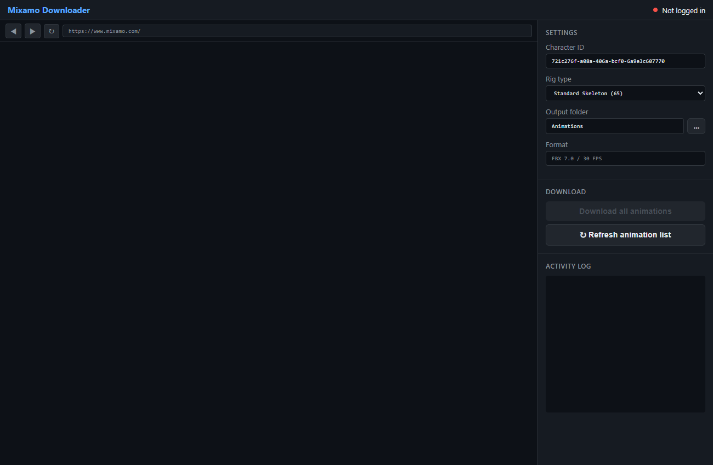

# Mixamo Downloader

An Electron desktop app for batch-downloading all your Mixamo animations (FBX) and animated GIF previews, with a built-in Mixamo browser for easy login.

   



> Log in with the embedded browser on the left, pick your rig and output folder on the right, then download every animation in one click.

---

## Features

- **Embedded Mixamo browser** — log in directly inside the app, token is captured automatically
- **Batch FBX download** — downloads all animations for your character in FBX 7.0 / 30 FPS format
- **Rig variants** — pick the skeleton your character uses (Standard 65-bone, 3-chain / 2-chain fingers, or no-fingers 25-bone). Each rig is downloaded into its own `rig_{N}/` folder with its own library file, so you can keep multiple bone variants of the same animation side by side
- **Animated GIF previews** — downloads the preview GIF for every animation (including per-animation previews for pack motions)
- **Pack support** — pack animations are organized into `_Packs/{Pack Name}/` subfolders automatically
- **Auto-reorganize & migration** — existing flat downloads are moved into the correct folders on startup; pre-rig downloads are migrated into `rig_25/` automatically
- **Live animation library** — builds and updates a per-rig `animation-library-{N}.json` during download with full metadata
- **Duplicate detection** — pack animations that are identical to standalone ones are cross-referenced in the library
- **README generation** — generates `LIBRARY_README.md` in your output folder describing the entire structure

---

## Output Structure

```
[your chosen folder]/
│
├── animation-library-65.json   ← machine-readable index for the 65-bone rig
├── animation-library-25.json   ← one library file per rig you download
├── LIBRARY_README.md           ← auto-generated documentation
│
├── rig_65/                     ← FBX files for the 65-bone (full finger) rig
│   ├── Animations/             ← standalone FBX files
│   │   ├── Running.fbx
│   │   ├── Idle.fbx
│   │   └── ...
│   └── _Packs/                 ← pack animations organized by pack name
│       ├── Male Locomotion Pack/
│       │   ├── running.fbx
│       │   └── ...
│       └── [other packs]/
│
├── rig_25/                     ← FBX files for the 25-bone (no-finger) rig
│   ├── Animations/
│   └── _Packs/
│
└── _GIF/                       ← animated GIF previews (shared across all rigs)
    ├── Running.gif
    ├── Idle.gif
    ├── ...
    └── _Packs/
        └── [Pack Name]/*.gif
```

> **Why rig folders?** Mixamo exports animations using the skeleton of the character you have loaded. A character without finger bones produces 25-bone animations; the standard rig produces 65-bone animations with full fingers. The two are **not interchangeable**, so the app keeps each bone count in its own `rig_{N}/` folder and never mixes them. GIF previews are identical regardless of rig, so they are stored once in a shared `_GIF/` folder.

---

## Requirements

- [Node.js](https://nodejs.org/) 20+
- A [Mixamo](https://www.mixamo.com/) account (free)

---

## Installation

```bash
git clone https://github.com/underfusion/mixamo-downloader.git
cd mixamo-downloader
npm install
```

Or on Windows, double-click `install.bat`.

---

## Usage

```bash
npm start
```

Or double-click `start.bat`.

1. **Log in** — the app opens Mixamo in the left panel. Log in with your Adobe account. The status dot turns green when the token is detected.
2. **Select your rig** — pick the **Rig type** that matches the character loaded in Mixamo (e.g. *Standard Skeleton (65)* for a full rig with fingers, *No Fingers (25)* for a simplified one). Animations are saved into the matching `rig_{N}/` folder. Choose **Custom…** to enter any bone count manually.
3. **Select output folder** — click `...` next to the output field to choose where to save animations.
4. **Download** — click **Download all animations**. The app will fetch the animation list and download every FBX + GIF.
5. **Fix GIFs** — if you already have FBX files, click **Download / Fix GIFs** to (re-)download all GIF previews without touching the FBX files.

> **Tip:** To collect the same animations for multiple rigs, load a different character in Mixamo, change the **Rig type** dropdown to match, and run the download again. The app downloads into a separate `rig_{N}/` folder each time — nothing is overwritten.

### Refresh animation list

Mixamo's animation list is cached locally for 24 hours. Click **Refresh animation list** to force a fresh fetch on the next download.

---

## CLI Tools

These scripts can be run independently from the command line:

### Generate / rebuild the animation library

```bash
node scripts/generate-library.mjs [output_dir]
# With API enrichment (fps, loop info):
set MIXAMO_TOKEN=<your_bearer_token> && node scripts/generate-library.mjs [output_dir]
```

### Download GIFs only

```bash
node scripts/download-gifs.mjs [output_dir]
# With pack GIFs (requires token):
set MIXAMO_TOKEN=<your_bearer_token> && node scripts/download-gifs.mjs [output_dir]
```

### Reorganize flat folder into packs

```bash
node scripts/reorganize.mjs            # dry-run — analysis only
node scripts/reorganize.mjs --move     # actually moves files
```

---

## animation-library-{N}.json

One library file is generated per rig (`animation-library-65.json`, `animation-library-25.json`, …) and updated automatically during download. The `{N}` is the bone count. Each file includes:

| Field | Description |
|---|---|
| `id` | Mixamo product UUID |
| `description` | Full animation name (used as filename) |
| `rig_bones` | Bone count of this rig (e.g. `65`, `25`) |
| `character_id` | Mixamo character UUID used for the download |
| `pack` | Pack name, or `null` for standalone |
| `fbx_file` | Relative path to the FBX file (includes the `rig_{N}/` prefix) |
| `gif_file` | Relative path to the GIF preview (shared `_GIF/` folder) |
| `fbx_downloaded` | `true` if the file exists on disk |
| `gif_downloaded` | `true` if the GIF exists on disk |
| `also_in_packs` | *(standalone only)* list of packs that contain this animation |
| `standalone_duplicate` | *(pack only)* reference to the standalone version if it exists |
| `thumbnail_animated` | CDN URL to the animated GIF preview |

### About duplicates

~600 out of ~745 pack animations are identical to standalone animations — same motion, same Mixamo `product_id`, just grouped into a themed pack. The library cross-references these so you can avoid loading duplicate files:

```js
// Load only unique animations (no pack duplicates) for the 65-bone rig
const lib = JSON.parse(fs.readFileSync('animation-library-65.json'));
const unique = lib.animations.filter(a => !a.pack || !a.standalone_duplicate);
```

---

## Notes

- The app caches the animation list in `animations-cache.json` (next to the app, not in your output folder)
- Download speed is intentionally throttled to avoid hitting Mixamo's rate limits
- The `animations-cache.json`, `download.log`, and your output folder are excluded from git

---

## Disclaimer

This is an unofficial, educational tool, not affiliated with, authorized, or
endorsed by Adobe or Mixamo. It automates exports from **your own** Mixamo
account using your own login session. Mixamo animations are free for personal
and commercial use, but automated/bulk access may conflict with Adobe's Terms
of Use — use at your own risk and respect Mixamo's rate limits. You are solely
responsible for how you use this software and the downloaded animations. The
author accepts no liability for account actions or misuse.

---

## Contributing

Issues and pull requests are welcome. If you find a bug or want a feature (a new rig preset, macOS/Linux packaging, etc.), open an issue.

---

## License

[MIT](LICENSE) © underfusion
